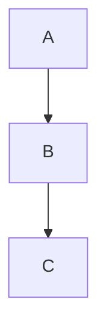

# Zenn Article Writing Skill

Zennプラットフォーム向けの技術記事作成に特化したスキルです。

## 記事ファイルの構造

Zennの記事は `articles/` ディレクトリに配置し、以下のフロントマターを含みます：

```yaml
---
title: "記事タイトル"
emoji: "🎉"
type: "tech" # tech: 技術記事 / idea: アイデア記事
topics: ["topic1", "topic2"] # 最大5つ
published: true # false で下書き
---
```

## Zennマークダウン記法

### 基本記法

#### 見出し
アクセシビリティの観点から見出し2（##）から始めることを推奨：
```markdown
## 見出し2
### 見出し3
#### 見出し4
```

#### テキスト装飾
```markdown
*イタリック*
**太字**
~~打ち消し線~~
`インラインコード`
```

#### リスト
```markdown
- リスト1
  - ネストリスト
- リスト2

1. 番号付きリスト
2. 番号付きリスト
```

#### リンクと画像
```markdown
[リンクテキスト](URL)

  # 幅指定
```

### コードブロック

言語指定とファイル名を付けられます：

````markdown
```js:example.js
const hello = "world";
```
````

diff記法も対応：
````markdown
```diff js
- const old = "value";
+ const new = "value";
```
````

### Zenn独自記法

#### メッセージボックス
```markdown
:::message
インフォメーションメッセージ
:::

:::message alert
警告メッセージ
:::
```

#### アコーディオン（トグル）
```markdown
:::details タイトル
折りたたまれる内容
:::
```

#### 数式（KaTeX）
```markdown
$$
e^{i\pi} + 1 = 0
$$

インライン数式: $a^2 + b^2 = c^2$
```

#### 脚注
```markdown
テキスト[^1]

[^1]: 脚注の内容
```

### 埋め込みコンテンツ

#### リンクカード
URLだけの行で自動変換：
```markdown
https://zenn.dev/zenn/articles/markdown-guide
```

#### 外部サービス埋め込み
```markdown
# YouTube
@[youtube](動画ID)

# GitHub
@[github](リポジトリURL)

# CodePen
@[codepen](ペンURL)

# Figma
@[figma](ファイルURL)

# Twitter/X
@[tweet](ツイートURL)

# SlideShare
@[slideshare](スライドキー)

# SpeakerDeck
@[speakerdeck](スライドID)

# JSFiddle
@[jsfiddle](URL)

# CodeSandbox
@[codesandbox](埋め込みURL)

# StackBlitz
@[stackblitz](埋め込みURL)
```

#### Mermaid図表
````markdown

````

制限：2000文字以内、チェーン数10個以内

## 記事作成のベストプラクティス

1. **ファイル命名**: `articles/` 配下に `slug.md` 形式で作成（slugは12〜50文字の半角英数字とハイフン）
2. **見出し構成**: h2から始め、論理的な階層構造を維持
3. **コードブロック**: 言語指定を必ず付ける、ファイル名があれば追記
4. **画像**: Zenn CLIで `npx zenn preview` 時はドラッグ&ドロップでアップロード可能
5. **トピック**: 関連性の高いものを最大5つまで設定
6. **絵文字**: 記事の内容を表す適切な絵文字を選択

## よく使うコマンド

```bash
# プレビュー
npx zenn preview

# 新規記事作成
npx zenn new:article

# 新規本作成
npx zenn new:book
```
